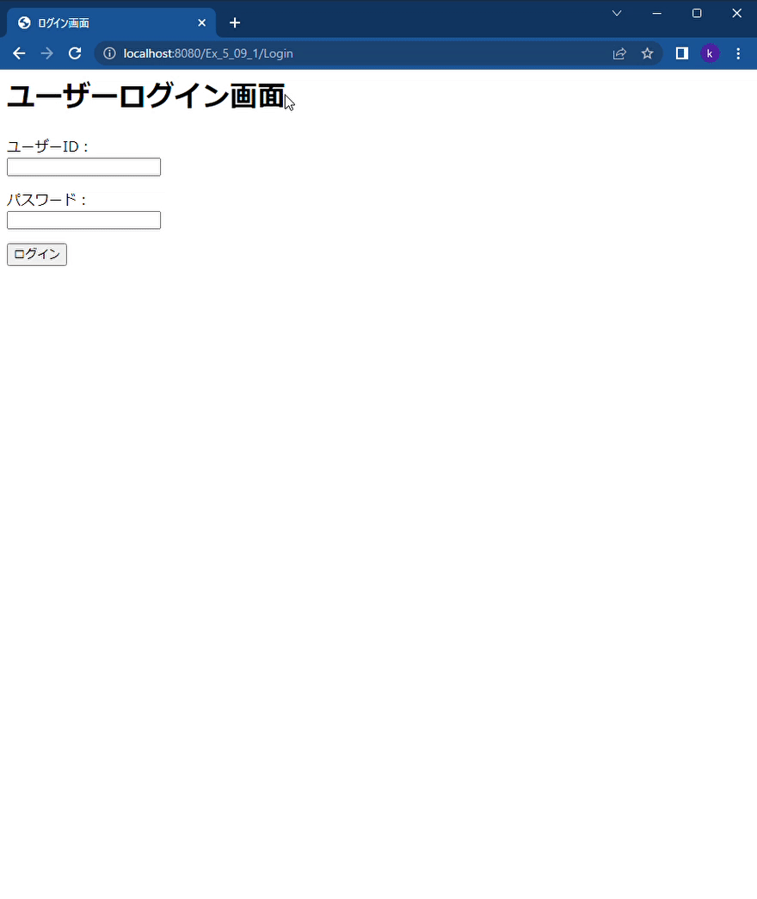

# questionnaire_form_1
***

***
## 主な機能
### 1. ユーザーログイン画面
* 未入力の場合JSでエラー表示
* ID　と　PASS がデータベースのデータと一致すればログイン処理
### 2. アンケート入力画面
* 未入力の場合JSでエラー表示
* 入力内容をデータベースに保存され、回答成功のhtmlへとびます
* 「回答一覧画面へ」をクリックすると回答一覧画面へリンク
* 「ログアウトするへ」をクリックするとログアウト処理実行（sessionの破棄）、ログアウト画面が表示されます
### 2. 回答一覧画面
* 今まで入力されたアンケートを一覧表示
* 1レコードづつArrayListで格納したもの表示
* エスケープ処理